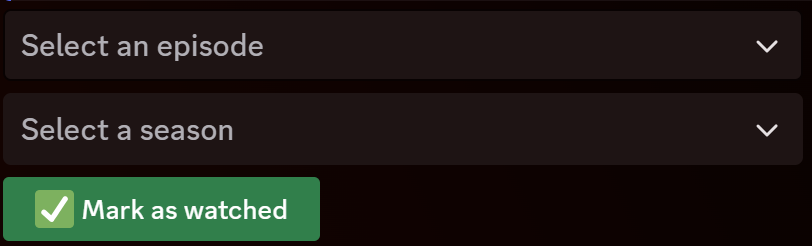

# Name <!-- fit -->

---

<Name> is a discord bot that allows you to look for a tv show or a movie, get information about it and mark / unmark it as watched.
Allows you to get statistics about the number of episodes, shows and movies you have watched.

---
## Features
<Name> Can be used with discord application commands, and has two main commands:
- `/search` to search for a tv show or a movie
- `/profile` to view your (or someone else's) profile

---

### Search

The search commands is easy to use. Just type `/search` followed by the name of the tv show or movie you want to search for, in the `query` option.
You also have access to two more (optional) options:
- `type`: to specify if you are looking for a tv show or a movie and filter the results
- `by_id`: to search for a specific tv show or movie by its thetvdb id. When using this option, you can simply input the id in the query, and make sure to specify the type, as thetvdb ids are not unique between tv shows and movies.

---

#### Search interface

The search interface responds with a message consisting of two to three buttons, depending on the type of media you are searching for, and a dropdown menu (except if you are searching by id).

---
#### Search interface

The dropdown allows you to quickly switch to another of the top 5 results, and the buttons allow you to mark the result as watched, favorite it, or in case of a tv show, view the episodes.

---
#### Search interface

The buttons are interactive, and you can click on them to perform the action you want, such as marking a tv show as watched or adding it to your favorites list.

> ℹ️ Marking an entire tv show as watched can sometimes take some time. There is no need to worry, the message will update when the operation is complete.

---
#### Episodes interface

The episode interface is displayed when you click on the episodes button in the search interface.
Like the search interface, it provides a *Mark as watched* button for each episode. It also provides two dropdown menus, for quickly switching between seasons and episodes.

---
### Profile

The profile command very simply displays the profile of the specified user, or yours if you no user is specified.
It has one (optional) option:
- `user`: to specify the user whose profile you want to view. If not specified, it will display your profile.

---
#### Profile interface

The profile interface displays the user's profile, with the TV shows, movies and episodes watched, and the favorite list.
It does not provide any interactive elements, as it is only meant to display information.
You can click on any show's link to view more information about it on thetvdb.

---
### Additional features
<Name> also has some additional features:
- A `/help` command to display a list of available commands
- A `/ping` command to check if the bot is online
- A `/sudo` command group, only available to the bot owner, to load, unload or reload extensions to improve the development experience

---
### Additional features

<Name> also has a custom rate limiter, both global and per user, to avoid spamming the bot with requests.
It also has a cache system to store the results from thetvdb and avoid making too many requests to the api, even though we did not find any information about rate limits on thetvdb's api documentation.

---
### Additional features
At last, <Name> has a built-in error handler to catch and show proper error messages to the user, instead of letting the command fail silently.

---
## Setting up
Before starting, there are some prerequisites you need to have:
- A discord bot token
- A thetvdb api key
- A directory on your host machine to store the database
- Docker and Docker Compose installed on your machine

---
## Setting up
In order to allow for an easy setup, we decide to go with Docker :whale: and Docker Compose for the deployment of the bot.
Since we use sqlite as a database, you will have to mount a volume to persist the data between restarts. Choose a directory on your host machine to store the database.
Then, create a docker-compose.yml file with the following content:

```yaml
version: '3.9'

services:
  bot:
    image: ghcr.io/itsdrike/code-jam-2024:main
    env_file:
      - .env
    volumes:
      - <path_to_your_database>/database.db:/app/database.db
```

---

## Setting up
You will also need to create a `.env` file in the same directory as the docker-compose.yml file.
There are two mandatory environment variables:
- `BOT_TOKEN`: the token of your discord bot
- `TVDB_API_KEY`: the api key for thetvdb (you can get one for free here: https://www.thetvdb.com/api-information)
```env
BOT_TOKEN=your_discord_bot_token
TVDB_API_KEY=your_thetvdb_api_key
```
This is the minimum configuration, but you can learn more about other environment variables [here](https://github.com/ItsDrike/code-jam-2024?tab=readme-ov-file#configuring-the-bot).

---
## Setting up
Once you have created the docker-compose.yml and .env files, you can start the bot by running the following command in the same directory as the files:
```bash
docker-compose up -d
```

---
## Theme
Our project, <Name>, is linked to the theme of the jam, *Information overload*.
The link is present through the ability to quickly find information about medias, and get some statistics about what you have watched.
We also tried to keep the interface as simple, intuitive and easy to use as possible, to avoid overwhelming the user with information.

---
## Contributions
- Core Bot Implementation:
  - Basic bot: ItsDrike
  - Logging: ItsDrike
  - Error handling: ItsDrike

- Infrastructure:
  - CI/CD: ItsDrike, Paillat-dev
  - Docker: ItsDrike, Paillat-dev

---

- Database and ORM:
  - Database models: ItsDrike, Paillat-dev, Benji
  - Alembic migrations: ItsDrike

- TheTVDB Integration:
  - TheTVDB client: ItsDrike, Paillat-dev, Ash8121

---

- User Interface and Interactions:
  - Help command: ItsDrike, Benji, Ash8121
  - Profile command: ItsDrike
  - Search command: ItsDrike, Paillat-dev
  - Favoriting, watching and episodes UI and logic: ItsDrike, Paillat-dev, Benji

- Performance and Security:
  - Cache: ItsDrike, Paillat-dev, Benji
  - Rate limiter: ItsDrike

- Admin Tools:
  - Sudo extension: ItsDrike
