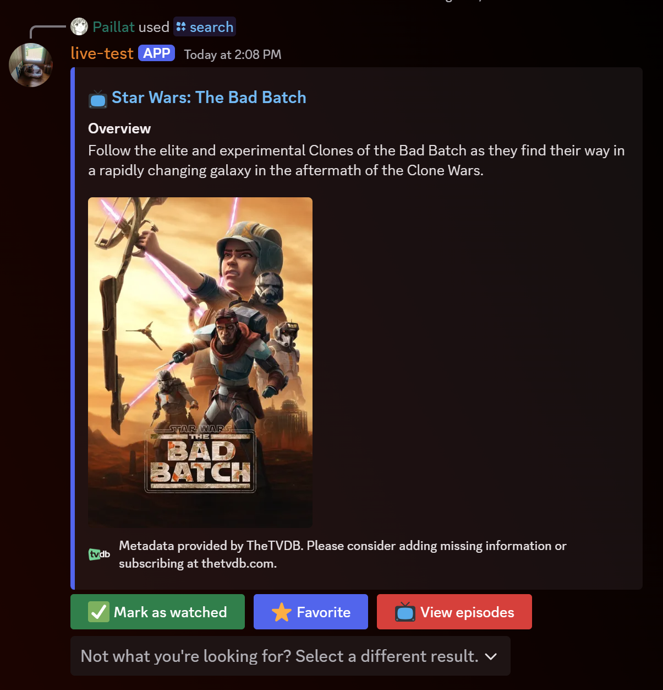
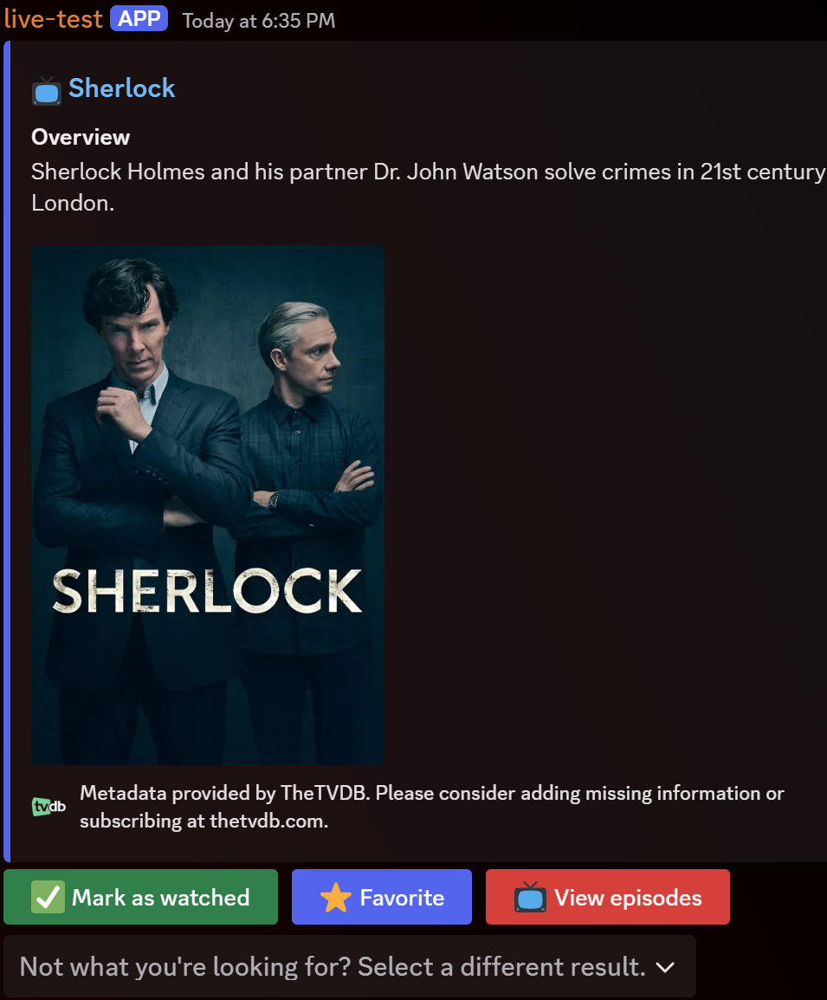
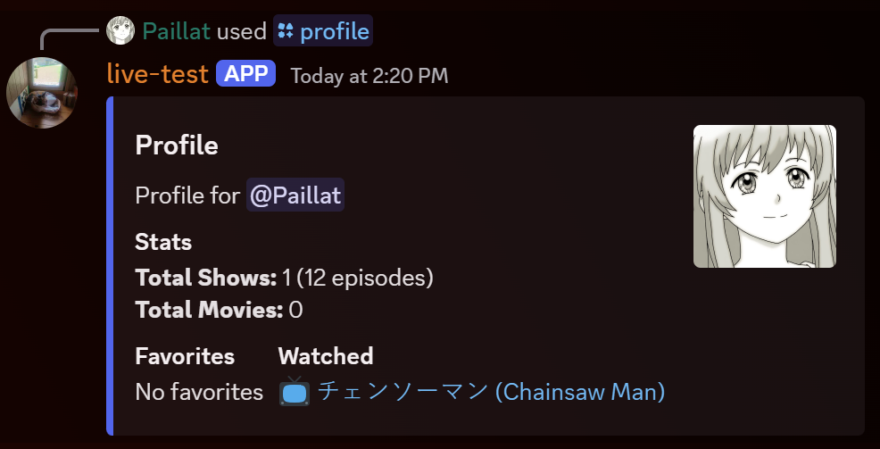
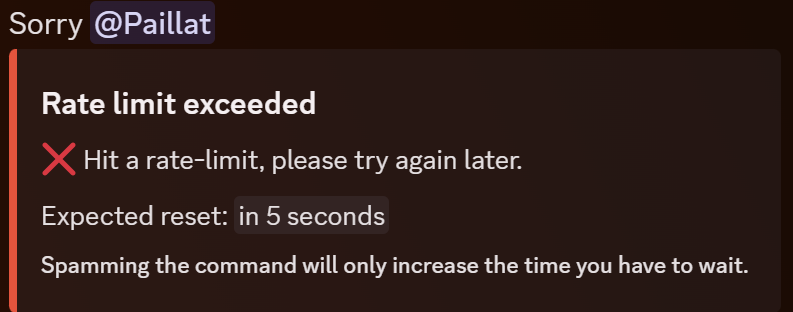

---
# This file is supposed to be viewed using marp, which is a tool for creating Markdown based presentations.
marp: true
footer: "Authors: ItsDrike, Benji, Paillat-dev, Ash8121"
class: invert
---

# Lumina Tracker <!-- fit -->

---

**Lumina Tracker** is a discord bot that allows you to keep track of the TV shows and movies that you have watched. You can use it to search for and see various information about the shows/movies you're interested in, but also to mark individual movies or show episodes as watched or favorite.

The bot then allows anyone to take a look at your profile, to see what you have watched, alongside with some neat statistics like the total number of episodes, shows and movies that you have tracked.

---

## Data

We decided to use TheTVDB service as the base for our bot. It's a massive database of TV shows and movies with an API that people can access for free (at least for non-profit / open-source projects). Without it, we wouldn't be able to create this bot, so they deserve a massive thanks from us.

---

## Features

Lumina Tracker can be used with discord application commands, and has two main commands:

- `/search` to search for a TV show or a movie
- `/profile` to view your (or someone else's) profile

---

### Search

The search command is easy to use. Simply type `/search` followed by the name of the TV show or movie you want to search for, in the `query` option.

You also have access to two more (optional) options:

- `type`: To specify if you are looking for a TV show or a movie and filter the results
- `by_id`: A boolean option that will interpret the query as a TheTVDB id. When using this option, make sure to specify the type, as TheTVDB ids are not unique between tv shows and movies.

---

#### Search interface


The search interface responds with a message consisting of two or three buttons, depending on the type of media you are searching for, and a dropdown menu.

---

#### Search interface - result picker


The dropdown allows you to quickly switch to another of the top 5 results, and the buttons allow you to mark the result as watched, favorite it, or in case of a TV show, view the episodes.

This menu is only shown if there was more than 1 result found for the query.

---

#### Search interface - buttons


The buttons are interactive, and you can click on them to perform the action you want, such as marking a TV show as watched or adding it to your favorites list.

<!-- TODO: This note is quite close to the end of the page, maybe decrease the font size? -->

> ℹ️ Marking an entire TV show as watched can sometimes take some time (depending on how many episodes it has). There is no need to worry, the message will update when the operation is complete.

---

#### Episodes interface


The episode interface is displayed when you click on the **View Episodes** button in the search interface. Like the search interface, it provides a _Mark as watched_ button, so that you can track episodes individually.

To choose between episodes, there are two dropdown menus, first for picking the seasons and second for the episode.

---

### Profile

The profile command displays various data and statistics for the specified user.
It has one (optional) option:

- `user`: To specify the user whose profile you want to view. If not specified, it will display your profile.

---

#### Profile interface


The profile interface displays the user's profile. It contains the amount of TV shows, movies and episodes watched, and a list with the shows marked as watched / favorite. It does not provide any interactive elements, as it is only meant to display information, but you can click on any show's link to view more information about it on TheTVDB.

---

### Additional features

Lumina Tracker also has some additional features:

- A `/help` command to display a list of all available commands
- A `/ping` command to check if the bot is online and its latency
- A `/sudo` command group, only available to the bot owner, to load, unload or reload extensions to improve the
  development experience.

---

### Additional features

Lumina Tracker also has a custom rate limiting system, both global and per user, to avoid spamming the bot with requests. Alongside that, we also added a cache system to store the results from TheTVDB and avoid flooding the api with the same requests.

---
### Additional features


Even though we did not find any information about rate limits in the documentation for TheTVDB API, we didn't want to abuse that fact and took the safer approach.

---

### Additional features

At last, Lumina Tracker has a built-in error handler to catch and show well formatted error messages to the user, directing them to the GitHub repository where they can report the issue, instead of letting the command fail silently.

---

## Setting up

Before starting, there are some prerequisites you need to have:

- A discord bot token
- A TheTVDB API key
- A place on your host machine to store the database
- Docker and Docker Compose installed on your machine

---

## Setting up

In order to allow for an easy and reproducible deployment setup, we decided to go with Docker :whale: and Docker Compose for the bot.

Since we use SQLite as a database, you will have to mount a volume to persist the data between restarts. Choose a place on your host machine to store this database and then create a `docker-compose.yml` file with the following content:

```yaml
version: "3.9"

services:
  bot:
    image: ghcr.io/itsdrike/code-jam-2024:main
    env_file:
      - .env
    volumes:
      - <path_to_your_database>/database.db:/app/database.db
```

---

## Setting up

You will also need to create a `.env` file in the same directory as the docker-compose.yml file.
There are two mandatory environment variables:

- `BOT_TOKEN`: The token of your discord bot
- `TVDB_API_KEY`: The API key for TheTVDB (you can get one for free here: https://www.thetvdb.com/api-information)

```env
BOT_TOKEN=your_discord_bot_token
TVDB_API_KEY=your_thetvdb_api_key
```

This is the minimal configuration, but you can learn more about other environment variables [here](https://github.com/ItsDrike/code-jam-2024?tab=readme-ov-file#configuring-the-bot).

---

## Setting up

Once you have created the `docker-compose.yml` and `.env` files, you can start the bot by running the following command in the same directory as the files:

```bash
docker-compose up -d
```

---

## Theme

Our project, Lumina Tracker, was created with the theme of the jam in mind: _Information Overload_.

All of us have probably watched a bunch of different shows and movies, but after a while, keeping track of everything that you've seen can get quite overwhelming.

The link to the theme is therefore present through the ability to quickly find information about these medias, alongside its ability to keep track of what you have watched and liked for you. We also tried to keep the interface as simple, intuitive and easy as possible, to avoid overwhelming the user with information.

---

## Contributions

- Core Bot Implementation:

  - Basic bot: ItsDrike
  - Logging: ItsDrike
  - Error handling: ItsDrike

- Infrastructure:
  - CI/CD: ItsDrike, Paillat-dev
  - Docker: ItsDrike, Paillat-dev

---

### Contributions

- Database and ORM:

  - Database models: ItsDrike, Paillat-dev, Benji
  - Alembic migrations: ItsDrike

- TheTVDB Integration:
  - TheTVDB client: ItsDrike, Paillat-dev, Ash8121

---

### Contributions

- User Interface and Interactions:

  - Help command: ItsDrike, Benji, Ash8121
  - Profile command: ItsDrike
  - Search command: ItsDrike, Paillat-dev
  - Favoriting, watching and episodes UI and logic: ItsDrike, Paillat-dev, Benji

---

### Contributions

- Performance and Security:

  - Cache: ItsDrike, Paillat-dev, Benji
  - Rate limiter: ItsDrike

- Admin Tools:
  - Sudo extension: ItsDrike

---

## Thanks

We'd like to thank Python Discord and the Event team for giving us the amazing opportunity to work on this project in a group. It was a lot of fun and we managed to learn a bunch of new things along the way!
